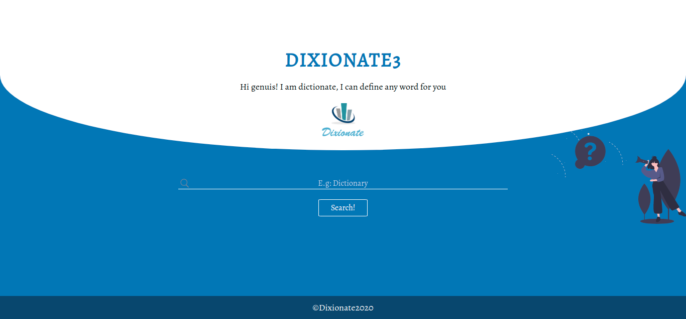

Build a GCE result check platform

1. Login using candidate name and number

2. Multiple logins. Friends and family might want to check on your results

3. Result recommendations:
Excellent, V.gd Good, fair, b.av, poor

4. Print a tentative result slip given that many people can't get to some schools or centers to have their slips

6. Results and School recommendations:
Repeat, Progress by applying for these schools

7. Career orientation for students

8. For 25 points students, possible
9.  scholarship opportunities and recommendations
A. Level students

9. Best series for O level students going to L6

10. School performance rank

7GCE Landing page: [click me!](https://github.com/yunweneric/GCE-platform-project)